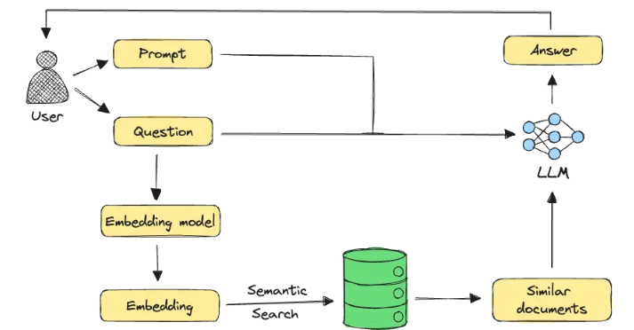

# 1 - Context
- By Apr 2025, Darp Conversation API building block is in alpha state and it seems not to support local LLM calls, see [link](https://docs.dapr.io/reference/api/conversation_api/).
- We can install Ollama locally in Kubernetes and select and small OSS LLM model and encoding for our lab/dev environment
    - Selected LLM: Llama3.2:1b
    - Selected embedding: UAE-Large-V1
- With the Darp annotations we sidecar Ollama container in the POD during its creation
- We can use Darp invokation building block (both http and darp sdk) to call the Llama3.2:1b LLM in Ollama from custom python scripts
- We can create a postgress database with some demo data to simulate different local data sources to play with the selected LLM
    - Postgres pgvector extension support vectors in the selected embedding format to be used in a semantic search by LLM
    - dvdrental is a relational database with dvdrental demo data, see [link]()
    - cosmopedia is a curated sintetic data set, see [link](https://huggingface.co/datasets/MongoDB/cosmopedia-wikihow-chunked?clone=true)
- We can create some PDF & DOCx files with different demo data to simulate local sources to play with the selected LLM

So, we are going to create some python demo projects:
- **guess_poems** - simple python to interact directly  with local LLM sending a promt
- **guess_films** - we create an agent that reads local postgresql dvdrental database film description data into a prompt and asks local LLM to guess the film tittle
- **guess_cosmopedia_questions** -  we create an agent that retrieves the most relevant results from the cosmopedia knowledge base loaded in local postgresql using RAG and local LLM.
 Image from www.mongodb.com blog  see [link](https://www.mongodb.com/developer/products/atlas/choose-embedding-model-rag/)
- More to come ...

# 2 - Why Llama3.2:1b LLM & UAE-Large-V1 embedding?

To sum up, Llama3.2:1b LLM & UAE-Large-V1 embedding can work effectively together in Intel/AMD & ARM CPUs with low memory requirements.

- Llama3.2:1b LLM: 
    - The Llama 3.2 family includes four models: 1B, 3B, 11B, and 90B. The 1B and 3B models are lightweight, text-only models designed for on-device applications. While they are primarily text-based, they can be effectively used in Retrieval-Augmented Generation (RAG) pipelines.
    - Context Window: Llama 3.2 1B supports a context window of 128,000 tokens, allowing it to process and understand a substantial amount of retrieved information

- UAE-Large-V1 embedding: UAE-Large-V1: A small-ish (335M parameters) open-source embedding model

## 2.1 - Can llama3.2:1b LLM work with UAE-Large-V1 embeddings?
- Yes, Llama 3.2:1B can work with UAE-Large-V1 embeddings. UAE-Large-V1 is a multilingual embedding model optimized for text retrieval across 26 languages, including English, Arabic, and others.  By integrating UAE-Large-V1 to generate embeddings for your text corpus and queries, you can enhance Llama 3.2:1B's retrieval-augmented generation (RAG) capabilities. This setup enables efficient retrieval of relevant information, allowing Llama 3.2:1B to generate more informed and contextually accurate responses.
Here's why:

* **UAE-Large-V1 Embeddings:** This model from WhereIsAI is designed to generate high-quality text embeddings (vectors) that capture the semantic meaning of text. These embeddings have a dimensionality of 1024. They are intended for various NLP tasks, including retrieval in RAG systems.
* **Llama 3.2 1B as a Language Model in RAG:** In a RAG pipeline, the LLM (like Llama 3.2 1B) uses the retrieved embeddings to understand the context relevant to the user's query and generate an informed response. The LLM itself doesn't directly "work with" the embedding model in a tightly coupled way during inference. Instead, it leverages the information that the embeddings help retrieve.
* **Compatibility in RAG Systems:** The key to making this combination work is the RAG framework you use. Frameworks like LlamaIndex or Langchain are designed to be model-agnostic when it comes to both the LLM and the embedding model. You can configure these frameworks to:
    1.  Use UAE-Large-V1 to generate embeddings for your knowledge base and user queries.
    2.  Use a vector database to store and retrieve the most relevant embeddings based on the query.
    3.  Pass the retrieved text (corresponding to the top embeddings) as context to the Llama 3.2 1B model to answer the query.
* **NVIDIA's Retrieval QA Embedding Model:** It's worth noting that NVIDIA provides a "NVIDIA Retrieval QA Llama3.2 1b Embedding Model." This is a fine-tuned version of the base Llama 3.2 1B specifically for retrieval tasks, and it produces embeddings with a dimension of 2048. While this is an alternative embedding model directly related to Llama 3.2 1B, it doesn't preclude using other embedding models like UAE-Large-V1 with the base Llama 3.2 1B for the language generation part of RAG.

**In essence, as long as your RAG pipeline is set up to use UAE-Large-V1 for generating and retrieving context, the Llama 3.2 1B language model can process that retrieved context to answer user queries.** The dimensionality of the embeddings (1024 for UAE-Large-V1) is a property of the embedding model and doesn't inherently prevent its use with Llama 3.2 1B as the generation model. The RAG framework handles the integration of these separate components.

## 2.2 - Both Llama3.2:1b LLM & UAE-Large-V1 embedding can work wit Intel/AMD  and ARM CPUs

### 2.2.1 - Can llama3.2:1b LLM  with UAE-Large-V1 embeddings work in Intel CPU?
-Yes, integrating the Llama 3.2:1B language model with UAE-Large-V1 embeddings on an Intel CPU is feasible and has been demonstrated to perform efficiently. Intel's 5th Generation Xeon processors, equipped with Advanced Matrix Extensions (AMX), have shown significant performance improvements for AI workloads, including both text generation and embedding tasks. For instance, benchmarks indicate that running Llama 3.2 3B on these processors achieves impressive throughputs while maintaining low latency. 

Additionally, AI PCs powered by Intel Core Ultra processors and integrated Intel Arc graphics have been demonstrated to run Llama 3.2 models effectively, delivering exceptional on-device AI inference suitable for client and edge applications. 

Therefore, deploying Llama 3.2:1B alongside UAE-Large-V1 embeddings on Intel CPU platforms is not only possible but also optimized for performance, making it a viable solution for various AI applications.
- Yes, **Llama 3.2 1B LLM with UAE-Large-V1 embeddings can definitely work on an Intel CPU.**

Here's a detailed explanation:

**1. Running Llama 3.2 1B on Intel CPU:**

* **Software Support:** Frameworks like Hugging Face Transformers, vLLM, and especially OpenVINO™ from Intel are designed to run large language models, including Llama 3.2, on CPUs.
* **Optimization:** Intel's OpenVINO™ toolkit specifically optimizes models for Intel hardware, including CPUs, through techniques like quantization and graph optimization. This can significantly improve inference speed on Intel processors.
* **ipex-llm:** Intel provides the `ipex-llm` library, built on top of Intel Extension for PyTorch (IPEX), which offers further optimizations for running LLMs on Intel CPUs. It supports integration with popular RAG frameworks like Langchain and LlamaIndex.
* **Performance Considerations:** While GPUs generally offer better parallel processing capabilities for LLMs, smaller models like Llama 3.2 1B can run reasonably well on modern Intel CPUs, especially for tasks with lower latency requirements or in scenarios where a dedicated GPU is not available. Performance will depend on the specific Intel CPU model, its core count, and RAM.

**2. Using UAE-Large-V1 Embeddings on Intel CPU:**

* **Embedding Generation:** The UAE-Large-V1 embedding model itself can be run on an Intel CPU. Libraries like Sentence Transformers, which support UAE-Large-V1, can perform the embedding calculations on the CPU.
* **Vector Database:** The vector database used to store and retrieve the embeddings (e.g., ChromaDB, Milvus, FAISS) also runs on the CPU.
* **RAG Pipeline Orchestration:** Frameworks like Langchain and LlamaIndex, which manage the overall RAG pipeline (embedding generation, retrieval, and language model inference), are CPU-compatible.

**3. RAG Pipeline on Intel CPU:**

* **Feasibility:** It is a common and supported scenario to build and run an entire RAG pipeline, including embedding generation with models like UAE-Large-V1 and language model inference with Llama 3.2 1B, on Intel CPUs.
* **Intel's Focus:** Intel actively develops and promotes tools and libraries to optimize AI workloads, including RAG pipelines, on their CPUs. They provide specific guides and integrations for this purpose with libraries like `ipex-llm` and OpenVINO™.
* **Azure Instances:** Even cloud providers like Azure offer virtual machines powered by 5th Gen Intel Xeon processors that are optimized for multimodal RAG solutions, highlighting the viability of using Intel CPUs for such tasks.

**In conclusion, you can confidently use Llama 3.2 1B LLM with UAE-Large-V1 embeddings in a RAG pipeline that runs entirely on an Intel CPU. While performance might differ compared to using a powerful GPU, it is a functional and increasingly optimized setup, especially for smaller LLMs and moderate workloads.**

### 2.2..2 - Can llama3.2:1b LLM  with UAE-Large-V1 embeddings work in ARM CPU?
- Also yes
- Yes, **Llama 3.2 1B LLM with UAE-Large-V1 embeddings can work on ARM CPUs.**

Here's a breakdown of why and how:

**1. Running Llama 3.2 1B on ARM CPU:**

* **Optimization for ARM:** Meta AI specifically optimized the Llama 3.2 1B and 3B models for ARM processors, recognizing their widespread use in mobile and edge devices.
* **Framework Support:** Frameworks like PyTorch (through libraries like `torch-neuronx` for AWS Inferentia and potentially others), TensorFlow Lite, and particularly **llama.cpp** are well-suited for running LLMs on ARM architectures.
    * **llama.cpp:** This library has demonstrated excellent performance for Llama models on ARM CPUs, including those found in devices like the Samsung S24+. It supports quantization techniques (like 4-bit integer) that significantly reduce memory and computational demands, making LLM inference feasible on resource-constrained ARM devices.
    * **Arm KleidiAI:** Arm provides the KleidiAI library, which is integrated into key AI frameworks like `llama.cpp` and PyTorch, offering optimized routines for accelerating AI workloads, including LLMs, on ARM Cortex-A and Neoverse CPUs. This can lead to significant performance improvements.
* **ExecuTorch:** Meta AI and Arm collaborated on integrating KleidiAI into ExecuTorch, a PyTorch-based framework for on-device AI. This further boosts the performance of quantized Llama models on ARM CPUs.

**2. Using UAE-Large-V1 Embeddings on ARM CPU:**

* **Embedding Generation:** Models like UAE-Large-V1, often used through libraries like Sentence Transformers, can perform embedding calculations on ARM CPUs. These libraries are generally CPU-agnostic.
* **Vector Databases:** Many popular vector databases that are used to store and retrieve embeddings in RAG systems have ARM support:
    * **Milvus:** Has explicit support for ARM-based machines and can be deployed on AWS Graviton instances.
    * **Weaviate:** Supports various architectures, including ARM64.
    * **Qdrant:** Also offers ARM64 support.
    * **FAISS:** As a fundamental library, it can be compiled and run on ARM architectures.
    * **Redis:** Versions 4.0 and above officially support ARM processors, making it suitable for vector storage with the Redis Stack.
    * **Vector:** A data collector that supports ARMv7 and ARM64 on Linux, making it relevant for certain vector search scenarios.

**3. RAG Pipeline on ARM CPU:**

* **Feasibility:** Building a complete RAG pipeline with Llama 3.2 1B and UAE-Large-V1 embeddings on an ARM CPU is not only feasible but is a growing area of development, especially for edge AI applications.
* **Performance:** While the performance might not match that of high-end GPUs, especially for larger batch sizes or more complex queries, the efficiency of Llama 3.2 1B and optimizations for ARM make it practical for many use cases, particularly on newer ARM-based CPUs with sufficient resources.
* **Cloud Instances:** Cloud providers like AWS (Graviton instances) and Google Cloud (Axion processors) offer ARM-based virtual machines optimized for various workloads, including machine learning and RAG applications.

**In summary, the combination of Llama 3.2 1B, UAE-Large-V1 embeddings, and an ARM CPU is a viable option for building RAG applications, especially for on-device or cost-effective cloud deployments. The availability of optimized libraries and increasing ARM CPU performance make this a promising direction for edge AI.**
