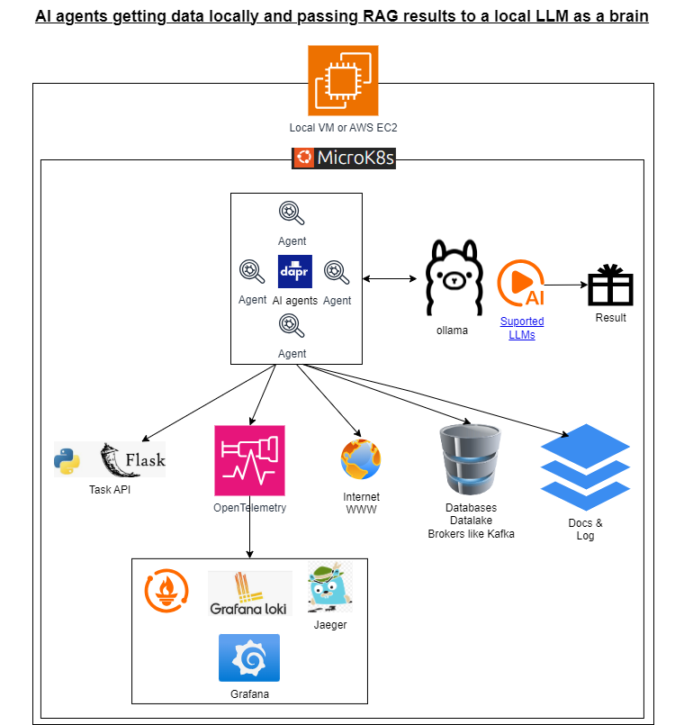

# 1 - Objective
- **NOT READY for use yet**
- **WIP - WIP - WIP - WIP - WIP - WIP - WIP - WIP - WIP - WIP**

Build a POC of AI agents (hands) getting data from local data sources and passing RAG results to local LLM (brain) with Ollama to get a human readable result.

Data is kept private and never goes outsite the company defined infrastructure.

All done with CNCF neutral vendor OSS technology.



**How is this done?**
- Picking and integrating key [CNCF's certified neutral vendor projects](https://www.cncf.io/projects/) such as:
    - Microk8s, see [certified kubernetes status](https://www.cncf.io/training/certification/software-conformance/) 
    - Dapr AI agents:
        - see [Dapr graduated status](https://www.cncf.io/projects/dapr/)
        - see [Dapr AI Agents Blog](https://www.cncf.io/blog/2025/03/12/announcing-dapr-ai-agents/)
    - Open Telemetry, see [incubating status](https://www.cncf.io/projects/opentelemetry/)
    - ArgoCD, see [graduated status](https://www.cncf.io/projects/argo/)
    - ...
- More on [CNCF projects status](https://www.cncf.io/project-metrics/) or [CNCF ecosystem landscape](https://landscape.cncf.io/)

**Motivation. Why is this project done? In orther to become a good hands on CTO/Architect/DevSecOps/SRE/Platform/AI engineer, you need to:**
- Play hard & work smart: undestanding by playing with some specially **selected & curated & documented** mini **POC (probe of concept)** projects.
- Explain what you have done to someone else for better understanding
- Try to return some value to OSS community. We receive a lot and contribute very little.

## 1.1 - Why Kubernetes?
**Kubernetes is vendor-neutral** because it:

- Is **open-source and governed by the CNCF**, with contributions from many companies.
- Can be **deployed on any infrastructure** (cloud, on-premises, hybrid).
- **Supports multiple extensions and integrations**, ensuring flexibility and compatibility.
- **Prevents vendor lock-in** by abstracting away cloud-specific details.

In short, Kubernetes is designed to be flexible, extensible, and cloud-agnostic, giving users the freedom to choose the best infrastructure for their needs without being tied to any one vendor.

## 1.2 - Why microk8s?
**MicroK8s is a great option for those who want a lightweight, minimal Kubernetes setup with production-ready features at a smaller scale**, and without the need for extra overhead. It is particularly useful for smaller deployments, edge computing, or environments where simplicity and cost are key factors.

You can **start small and install microk8s under your PC WSL2/Ubuntu or AWS free tier machine and later on move those projects into [microk8s HA environment](https://www.cncf.io/online-programs/microk8s-ha-under-the-hood-kubernetes-with-dqlite/), EKS, AKS, GKS or OpenShift**. 

This **use case is specially valuable** when corporate close minded IT/SOC/SecOps/platform teams does not provide confortable lab/dev environments and developers are left in **"very restricted"** or **"do everything by your own" schenarios**. **DevOps culture is not the same in every place**.


## 1.3 - Why DAPR AI Agents?
This is a summary from [CNCF's Dapr AI Agents Blog](https://www.cncf.io/blog/2025/03/12/announcing-dapr-ai-agents/)

- **Robust and well-integrated workflow capabilities right from the very beginning**: Dapr Agents is built on top of Dapr’s full featured workflow engine. Dapr is reliable for production use cases. Dapr Agents uses Dapr’s proven workflow system, which is designed to handle failures, retries, and scaling. This gives 

- **Databases and message broker abstraction**: Dapr Agents abstracts integrations with databases and message brokers using Dapr’s consistent programming model. You can  switch between databases like Postgres, MySQL, AWS DynamoDB and a dozen others without having to rewrite your agent code. Additionally, Dapr Agents integrates seamlessly with Kubernetes environments and runs just as well locally or on a VM.

- **Communication through message brokers**: as mentioned above, Dapr Agents communicate through message brokers. This allows for collaborative workflows where agents with different roles can share context leading to very reliable communications and no loss of context in a large multi-agent setup.

- **OpenTelemetry support**: Dapr Agents offers metrics and tracing out-of-the-box, supporting Prometheus and OpenTelemetry formats respectively.

- **Event-driven and non-deterministic execution**: next agent to respond can be dynamically determined by an LLM, enabling autonomous and evolving workflows.

- Additionally, **[Dapr can be used from any developer framework and python/Flask is carefully integrated](https://docs.dapr.io/concepts/overview/#developer-frameworks)**

## 1.4 - Why Ollama?
**Ollama is a powerful tool for anyone looking to work with different LLMs in a local and vendor-neutral way**. It allows you to:

- **Run multiple models locally (privacy & security)** without the need for cloud infrastructure.
- Have ***full control over your models and hardware**. This allows you to choose the right model for your task, whether it’s for creative writing, summarization, answering questions, or any other use case. You can use any of the **[following models](https://github.com/ollama/ollama/blob/main/README.md#model-library) on the list** depending on your hardware mem/cpu constraints. **"You should have at least 8 GB of RAM available to run the 7B models, 16 GB to run the 13B models, and 32 GB to run the 33B models."**
- Avoid cloud dependencies and costs. Still you can run it in any cloud, of course.
- Ensure privacy by processing data locally.
- It’s ideal for developers, researchers, or anyone who wants to experiment with multiple LLMs without being locked into a specific cloud vendor or paying for expensive API calls.

**Be aware of Dapr support for Mistral and Mistral running on CPU** see [link](https://heidloff.net/article/running-mistral-locally-cpu/https://heidloff.net/article/running-mistral-locally-cpu/)
- https://www.oneclickitsolution.com/centerofexcellence/aiml/run-mistral-7b-locally-hardware-software-specs

## 1.5 - Why Open Telemetry?

- Unified solution for **collecting metrics, logs, and traces,** which gives a comprehensive view of your system's health and performance.
- **Vendor-neutral and open-source project governed by the Cloud Native Computing Foundation (CNCF)**, preventing lock-in and allowing you to send telemetry data to multiple backends.OpenTelemetry allows you to send telemetry data to multiple backends, such as Prometheus, Jaeger, Loki, Zipkin, Elasticsearch, or OpenSearch.
- **Improved observability**, especially for modern distributed systems (like microservices) where tracing and metrics are crucial. With metrics, you can monitor key performance indicators (KPIs) and set up alerts for anomalies. With logs, you can inspect and troubleshoot specific events, and with traces, you can identify the root cause of latency or failures in complex, distributed systems.
- **Simplified instrumentation**, with automatic and manual methods for collecting data, depending on your needs.
    - **out-of-the-box instrumentation or auto-instrumentation** 
        - for many popular programming languages (including Python, Java, Go, JavaScript, and more) and libraries (such as HTTP servers, databases, message queues, and more). You simply add **OpenTelemetry SDKs to your code**, and it will automatically collect and export telemetry data for you.
        - **Agents** for legacy applications or code you can not touch.
    - **Optional custom instrumentation**: for custom application components, OpenTelemetry also provides APIs/SDK to manually instrument parts of your code.
- **Scalability and flexibility** to fit a wide variety of system architectures thank to the flexibility of the OpenTelemetry collector.
- **Extensibility to integrate with many third-party systems and tailor the solution** to your specific needs with Kubernetes, Docker, Helm, Prometheus, Loki, Jaeger, existing observability platforms, such as Datadog, Elastic Stack, and New Relic, have built-in support for OpenTelemetry.
- **Cost-effective**monitoring with control over where data is sent and stored.
- **Strong community support and integration with the broader cloud native ecosystem**.
- OpenTelemetry is rapidly becoming the **industry standard for observability**.

## 1.6 - Why Flask?
**Flask is a popular lightweight web framework for Python, and it can be a great choice for building microservices**. Flask offers several advantages:

- **Simplicity**: If you want to build lightweight, independent RESTful API services with **minimal setup and configuration**, Flask is a great choice.
- **Flexibility**: If you need a flexible framework that can integrate with many different backends and services, Flask can give you that flexibility without locking you into a rigid structure.
    - **Asynchronous Support**: While Flask is synchronous by default, it can be extended to handle asynchronous requests, which can be important for microservices that require non-blocking IO.
    -**Flask supports both synchronous and asynchronous communication**, which is essential in a microservices environment where services need to talk to each other efficiently. You can implement REST API calls or even **integrate with messaging systems like RabbitMQ, Kafka, or Redis for event-driven architectures*.
        - **WebSockets for real-time communication**: Flask can be easily integrated with libraries like Flask-SocketIO to allow WebSocket connections for real-time, bidirectional communication between services or clients.
        - **RPC (Remote Procedure Call)**: Flask allows you to set up RPC-style communication using protocols such as gRPC or JSON-RPC if you need low-latency communication.
- **Quick Prototyping**: If you need to quickly spin up new services or APIs in a microservices architecture, Flask’s simplicity allows for rapid development.
- **Small to Medium-Scale Microservices**: Flask is ideal for smaller-scale microservices where performance and complexity are not the primary bottlenecks. For larger-scale systems, you might need a more robust solution (e.g., FastAPI, Spring Boot, or Go).**Be aware of:**
    - **Flask is Single-Threaded** by Default when running the development server (which uses Werkzeug). This means it can only handle one request at a time per worker process, which makes it unsuitable for production use due to limitations in handling concurrent requests.
    - Here comes **Gunicorn to the rescue** as **Gunicorn can spawn more workers to distribute the load**. This way, you can handle multiple requests at once and ensure that your app remains responsive even under heavy load.
    - When you run a Flask application with Gunicorn, **each Gunicorn worker acts as an independent Flask process**, and each of those workers is generally a single-threaded Flask application.

- **Monitoring and Tracing**: Flask integrates well with **OpenTelemetry**, Prometheus, and other monitoring tools for tracking the health and performance of your microservices.

## 1.7 - Why OpenTofu for IaC?
OpenTofu (formerly known as Terraform) is the community driven OSS tool for Infrastructure as Code (IaC) after Hashicorp/IBM licence was changed. Some features are:

- **Declarative Configuration**: OpenTofu uses a declarative language (HashiCorp Configuration Language, or HCL) to define infrastructure. You specify what the end state of the infrastructure should look like, and OpenTofu figures out how to achieve that state. 
- **Multi-Cloud and Multi-Service Support**: OpenTofu works with a wide variety of cloud providers (AWS, Azure, Google Cloud, etc.) and other services like Kubernetes, GitHub, and even on-premises solutions. This flexibility allows organizations to manage infrastructure across different platforms in a unified way.
- **Version Control**: since OpenTofu configurations are written in plain text files, they can be stored in version control systems like Git. This brings benefits like collaboration, change tracking, and the ability to roll back changes to previous configurations.
- **Modular Architecture**: OpenTofu supports the creation of reusable modules that encapsulate common infrastructure patterns. This modularity allows teams to create reusable and shareable components, which increases efficiency and reduces duplication.
- **State Management**: OpenTofu keeps track of the state of your infrastructure using a state file. This enables it to understand the current configuration and make incremental updates. It also provides features like plan and apply, where you can preview changes before applying them to ensure the desired result.
- **Extensibility and Ecosystem**: OpenTofu has a rich ecosystem with a large number of community-contributed providers and modules. This extensibility allows it to support a wide range of infrastructure types and services.
- **Automation and Scalability**: OpenTofu can be integrated with continuous integration/continuous deployment (CI/CD) pipelines to automate infrastructure provisioning and updates. This is particularly valuable for scaling environments, managing complex systems, and maintaining consistency across large teams or organizations.
- **Cloud Agnostic**: One of the most important features of OpenTofu is its cloud-agnostic nature. It allows you to write infrastructure code that can be reused across multiple cloud providers or environments without being tightly coupled to a specific one.
- **Infrastructure as Code Best Practices**: OpenTofu follows IaC best practices, such as immutability, idempotency, and automation, which help ensure that infrastructure is always in a known and desired state.
- **Open-Source and Community-Driven**: OpenTofu is open-source, which means the community has control over the development and improvement of the tool. Organizations can contribute to its evolution and benefit from improvements made by the broader ecosystem.

## 1.8 - Why Shell script & kubectl & Helm over Ansible to automate internal configuration?
Ideally, in this POC, **we are going to install everything in one VM inside microK8s**:
- We can use OpenTofu and AWS EC2 "userdata" to execute Shell scripts and install packages & microk8s inside a VM
- We can use OpenTofu for:
    - Applying Kubernetes manifests with kubectl.
    - Installing and configuring Helm charts.
    - Combining kubectl and helm to automate Kubernetes management tasks.

**Why we are not using Ansible?**:
- Shell scripts + kubectl + Helm are ideal for highly specific, Kubernetes-centric tasks and rapid prototyping.**Exactly OUR POC case**.
- Ansible is better suited for configuration management across diverse systems, complex workflows, and large-scale infrastructure automation.

## 1.8 - Why not a CI/CD like Gitlab?
I love Gitlab OSS vs SaaS product and commercial strategy and although I have considered installing it, finally I did not for this POC. Here why:
- Installing Gitlab OSS requires quite a lot of RAM
- The microservices we are going to install are simple POCs with not real need of CI quality requirements

## 1.9 - Why ArgoCD?
ArgoCD is installed inside microk8s and can be linked into a git repo so whatever changes we make to the code is deployed inside K8S.

Ideally, we are going to incrementally add more and more features and best practices to our POC microservices, so, it would be nice be nice have a CD (continuous deployment) in our microk8s after we push whatever code or config change into our microservices POC git repo.

# 2 - Here some of the selected POCs
**WIP**
```
├── 1-microk8s: we choose microK8S as the neutral vendor platform to run differents POCs
│   ├── AWS: TF/OpenTofu scripts to run it in AWS free tier t4g Ubuntu
│   └── WSL2: how to install it locally in WSL2 - Ubuntu 22
├── 2-Docker
│   └── tasks-flask-api
├── 3-K8s-task-flask-api: with our own Task application we CRUD tasks in MongoDB in K8S platform
├── 4-K8s-Best-practices
├── 5-BigData-AI
│   └── Dapr
│   └── Ollama
├── 6-OpenTelemetry
``` 
# 3 - Install
**WIP**
Go to each numbered POC subfolder for installation instructions and project more detailed explanations